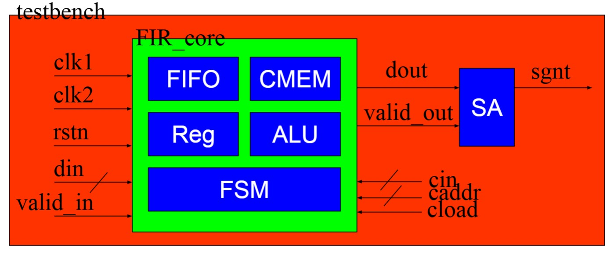
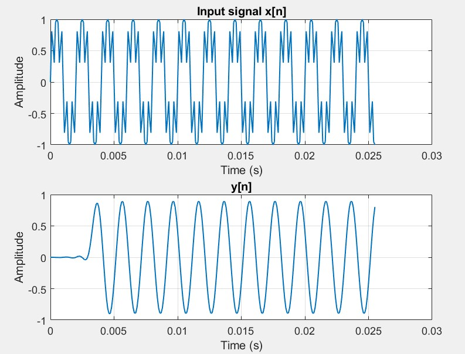
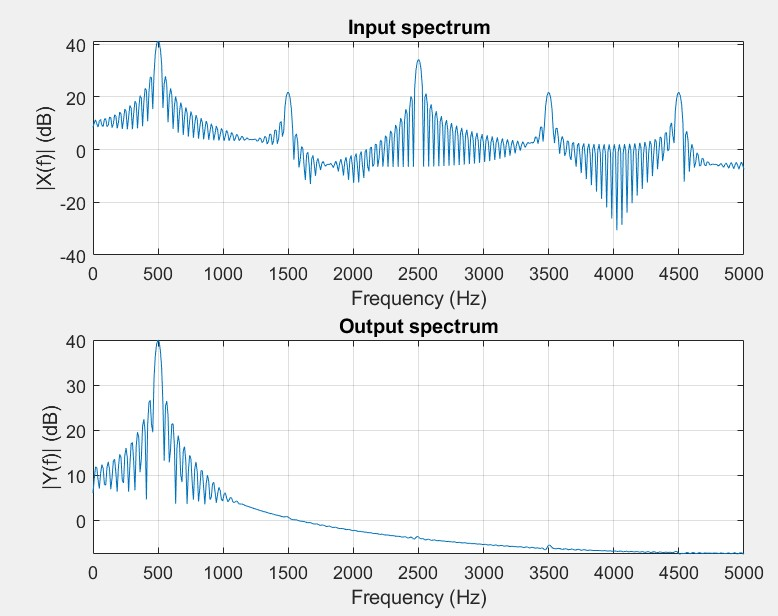
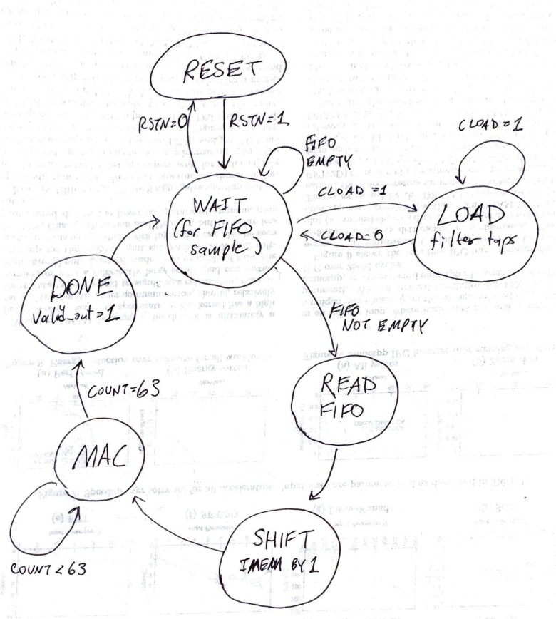
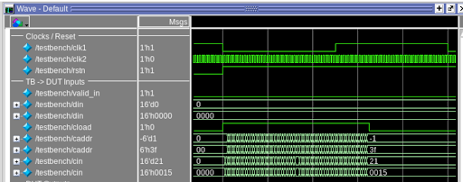
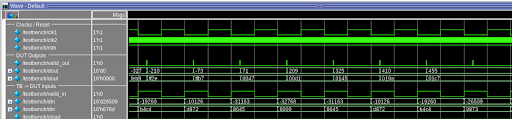
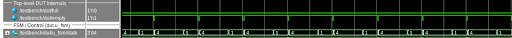

# FIR Core: Design, Verification, and Post-Synthesis Analysis

Design and verification of a dual-clock finite impulse response (FIR)
filter core that accepts Q1.15 input samples, applies a 64-tap low-pass filter with Q1.15 coefficients, and produces saturated Q7.9 outputs. The design uses a dual-clock FIFO to bridge an
input sampling clock (`clk1`) and a higher-rate compute clock (`clk2`). Verification is performed
using MATLAB-generated golden outputs and accuracy is summarized using normalized root
mean squared error (NRMSE). Post-synthesis timing, area, and power are characterized using
PrimeTime.

## 1 System Overview

### 1.1 High-level architecture

Figure 1 illustrates the FIR core top-level:

- **Dual-clock FIFO** buffers incoming samples in the `clk1` domain and supplies them in the `clk2` domain.
- **Coefficient memory (CMEM)** stores 64 taps (loaded via `cload/caddr/cin`).
- **Input memory (IMEM)** is a 64-deep shift register holding the most recent samples.
- **ALU/MAC** multiplies one tap-sample pair per `clk2` cycle and accumulates across 64 taps.
- **FSM + counter** schedules load/shift/MAC and asserts `valid_out` for each computed output sample.

**Figure 1: Top-level FIR core architecture**  

<p align="center">
  
</p>

### 1.2 Fixed-point formats

- Inputs: Q1.15 signed 16-bit.
- Coefficients: Q1.15 signed 16-bit.
- Product: 16×16 to signed 32-bit.
- Accumulator: signed 41-bit to safely sum 64 products.
- Output: arithmetic right shift by 21 bits to Q7.9, saturate to signed 16-bit.

## 2 Performance Metrics

Table 1 summarizes performance, clocking, energy, area, and accuracy.

**Table 1: FIR core metrics summary.**

| Metric | Value |
|---|---|
| Input clock frequency (`fclk1`) | 10 kHz (from testbench: `#50000` half-period) |
| Compute clock frequency (`fclk2`) | 1 MHz (from testbench: `#500` half-period) |
| Throughput | 10 kS/s (1.0e4 samples/s) |
| Estimated fmax on clk2 path | 40.5 MHz (4.0455e7 Hz), from worst path ≈24.7 ns |
| Theoretical throughput @ fmax | 604 kS/s (6.038e5 samples/s) |
| Total power (PrimeTime time-based) | 3.740 × 10−5 W (≈ 37.4 µW) |
| Energy efficiency @ 10 kS/s | 3740 pJ/sample |
| Area | 0.13721417 mm2 |
| Accuracy NRMSE (average) | 0.033273 (3.3%) |
| Accuracy NRMSE (worst-case) | 0.052138 (5.2%) |

### Notes on energy per sample

Using PrimeTime-reported total power **P** and a steady-state sample rate **R**:

$E_{sample} = \frac{P}{R}$

At R = 10 kS/s and P = 37.4 µW, $E_{sample}$ ≈ 3740 pJ/sample.

## 3 MATLAB Vector Generation and Golden Outputs

Stimulus and golden outputs are generated in MATLAB (`gen_fir_vectors.m`). The script:

1. Designs a 64-tap low-pass FIR (`fir1`).
2. Generates a two-tone input (500 Hz passband + 2.5 kHz stopband).
3. Quantizes samples and taps to Q1.15 and writes hex files.
4. Produces Q7.9 golden (`y_q79_out.txt`).
5. Produces float32 goldens for NRMSE comparison

### 3.1 Filter/tone generation and quantization

```matlab
Fs = 10e3; N = 256; n = (0:N-1).’; L = 64;
wc_norm = 0.2;
h = fir1(L-1, wc_norm, ’low’); % 64 taps
f_low = 500; f_high = 2500;
x = 1.0*sin(2*pi*f_low*n/Fs) + 0.5*sin(2*pi*f_high*n/Fs);
scale_q15 = 2^15 - 1;
x_q15 = int16(max(min(round(x*scale_q15), 32767), -32768));
h_q15 = int16(max(min(round(h*scale_q15), 32767), -32768));
````

### 3.2 Fixed-point hardware-math emulation to Q7.9

```matlab
x_int = int32(x_q15);
h_int = int32(h_q15);
y_q79_int = zeros(N,1,’int16’);
for n_idx = 1:N
acc = int64(0);
for k = 0:L-1
x_idx = n_idx - k;
if x_idx >= 1 && x_idx <= N
acc = acc + int64(x_int(x_idx)) * int64(h_int(k+1));
end
end
acc_shifted = bitshift(acc, -21); % -> Q7.9
acc_shifted = min(max(acc_shifted, -32768), 32767);
y_q79_int(n_idx) = int16(acc_shifted);
end
```

### 3.3 Float32 goldens for NRMSE

```matlab
y_gold_unquant_f32 = single(filter(h, 1, x));
x_q15_real = double(x_q15) / (2^15);
h_q15_real = double(h_q15) / (2^15);
y_gold_q15stim_f32 = single(filter(h_q15_real, 1, x_q15_real));
```

### 3.4 MATLAB plots

**Figure 2: MATLAB analysis plots**

| (a) Filter magnitude response                  | (b) Input/output spectra                       |
| ---------------------------------------------- | ---------------------------------------------- |
|  |  |

## 4 RTL Design: Modules and Function

This section describes each RTL module and its role in the overall FIR core.

### 4.1 `fifo`: Dual-clock FIFO (CDC bridge)

The FIFO accepts valid in/din on clk1 and provides samples to the compute domain clk2. Gray-
coded read/write pointers are synchronized across clock domains to safely generate full/empty
flags.

```systemverilog
function [ADDR_WIDTH:0] bin2gray;
input [ADDR_WIDTH:0] bin;
begin
bin2gray = (bin >> 1) ^ bin;
end
endfunction
assign full = (wptr_gray_next ==
{~wq2_rptr_gray[ADDR_WIDTH:ADDR_WIDTH-1],
wq2_rptr_gray[ADDR_WIDTH-2:0]});
assign empty = (rptr_gray == rq2_wptr_gray);
```

### 4.2 `cmem`: Coefficient memory

cmem stores 64 taps. During coefficient loading (cload=1), the address is driven by caddr. During
compute, the effective address is driven by the internal tap index (q) (with a small offset adjustment
in the top-level to align read timing).

```systemverilog
always @(posedge clk or negedge rstn) begin
if (!rstn) begin
for (i = 0; i < 64; i = i + 1) taps[i] <= 16’sd0;
end else if (cload) begin
taps[caddr] <= cin;
end
end
assign tap = taps[caddr];
```

### 4.3 `imem`: Input shift register (sample history)

imem holds the most recent 64 samples in a shift-register structure. When load sample=1, it shifts
and inserts the new FIFO output at index 0.

```systemverilog
always @(posedge clk2 or negedge rstn) begin
if (!rstn) begin
for (i = 0; i < 64; i = i + 1) X_REG[i] <= 16’sd0;
end else if (load_sample) begin
X_REG[0] <= din;
for (i = 63; i > 0; i = i - 1)
X_REG[i] <= X_REG[i-1];
end
end
assign x = X_REG[raddr];
```

### 4.4 `counter`: Tap index generation

A 6-bit counter generates the tap/sample index q (0 to 63) during the MAC phase.

### 4.5 `alu`: Multiply-accumulate + Q7.9 scaling + saturation

The ALU multiplies Q1.15 sample and coefficient (signed) to a 32-bit product, sign-extends to 41
bits, and accumulates across taps. After completion, it shifts right by 21 to align to Q7.9, then
saturates to a 16-bit signed output.

```systemverilog
wire signed [31:0] prod_s = x_s * coeff_s;
wire signed [40:0] prod_ext = {{9{prod_s[31]}}, prod_s};
wire signed [40:0] acc_sh = acc >>> 21; % -> Q7.9
wire signed [15:0] raw_out = acc_sh[15:0];
always @(*) begin
if (acc_sh > 16’sh7FFF) acc_shifted = 16’sh7FFF;
else if (acc_sh < 16’sh8000) acc_shifted = 16’sh8000;
else acc_shifted = raw_out;
end
```

### 4.6 `fir_fsm`: Control scheduling

The FSM sequences computation per output sample.

* **READ**: pop one sample from FIFO (rd en=1)
* **SHIFT**: load into IMEM and clear accumulator/counter
* **MAC**: iterate 64 taps (counter en=1, done flag=0)
* **DONE**: assert valid out for one clk2 cycle and latch output

**Figure 3: FSM diagram**

<p align="center">
  
</p>

### 4.7 `fir_core`: Top-level integration

The top module instantiates FIFO, CMEM, IMEM, counter, ALU, and FSM. It also registers dout
only when valid out is asserted, ensuring stable outputs between results.

## 5 Verification Environment

Verification uses:

* **Input files**: `x_q15_in_hex.txt`, `cmem_in_hex.txt`
* **Fixed-point golden**: `y_q79_out.txt`
* **Float32 golden**: `y_f32_gold_unquant_hex.txt` (IEEE-754 bits)

The testbench:

1. Loads CMEM taps.
2. Drives input samples into FIFO (single valid in pulse per clk1 period).
3. On each valid out, compares fixed-point output and accumulates error vs float32 golden.
4. Reports average and worst-case NRMSE:

### 5.1 NRMSE definition used

Let $y[n]$ be golden and $\hat{y}[n]$ be DUT output in float:

$$
RMSE = \sqrt{\frac{1}{N}\sum_{n=0}^{N-1}(y[n]-\hat{y}[n])^2}
$$

$$
NRMSE = \frac{RMSE}{y_{max}-y_{min}}
$$

Worst-case NRMSE is computed as:

$$
NRMSE_{worst} = \frac{\max_n |y[n]-\hat{y}[n]|}{y_{max}-y_{min}}
$$

```systemverilog
ygold_sr = $bitstoshortreal(ygold_u32mem[compare_idx]);
y_exp_real = real’(ygold_sr);
y_dut_real = real’(y_dut_i) / 512.0; % Q7.9 scale
diff_r = (y_exp_real - y_dut_real);
sse = sse + (diff_r * diff_r);
abs_diff_r = (diff_r < 0.0) ? -diff_r : diff_r;
if (abs_diff_r > max_abs_err) begin
max_abs_err = abs_diff_r;
max_err_idx = compare_idx;
end
```

### 5.2 Waveforms and Results

**Figure 4: Loading of CMEM while cload=1**

<p align="center">
  
</p>

**Figure 5: valid out spikes at each clk1 cycle demonstrate 10KS/s throughput**

<p align="center">
  
</p>

**Figure 6: state changes when fifo is NOT empty**

<p align="center">
  
</p>

Accuracy results:

```systemverilog
# Matches         : 187
# Mismatches      : 68
# Avg NRMSE   (RMSE/(ymax-ymin))        : 0.033273
# Worst NRMSE (max|e|/(ymax-ymin))      : 0.052138
# Expected float range used for norm    : [-0.997950315, 0.98874718] (range=1.98669749)
# Worst error sample idx                : 37
#   DUT_REAL=0.865234375  GOLD_F32=0.968817353  |e|=0.103582978
```

## 6 Post-Synthesis PrimeTime Analysis

This section summarizes timing, area, and power based on the provided PrimeTime reports.

### 6.1 Timing

A representative max path in the clk2 group shows a data arrival of approximately 24.255 ns
(with very large positive slack under a 1 µs clock constraint). Using the reported path delay as a proxy
for critical delay, an approximate fmax can be estimated as:

$$
T_{min} \approx 24.255\text{ ns} + 0.464\text{ ns} \approx 24.72\text{ ns}
\Rightarrow f_{max} \approx 40.5\text{ MHz}
$$

```text
Startpoint: u_counter_q_reg_0_ (clocked by clk2)
Endpoint  : u_alu_acc_reg_40_  (clocked by clk2)
...
data arrival time      24.2550
data required time    999.5362
slack (MET)           975.2812
```

### 6.2 Area

PrimeTime reports a total area of 137214.17 µm2

The total area in mm2 is:

$$0.13721417\text{ mm}^2$$

```text
Total 42 references                                   137214.17
```

### 6.3 Power

PrimeTime time-based power (at the modeled activity) reports:

* Total power: 37.4 µW
* Clock network dominates power (reported ∼ 89.6%)

```text
Total Power            = 3.740e-05  (100.00%)
clock_network          = 3.352e-05  (89.64%)
combinational          = 3.467e-06  ( 9.27%)
register               = 4.094e-07  ( 1.09%)
```
